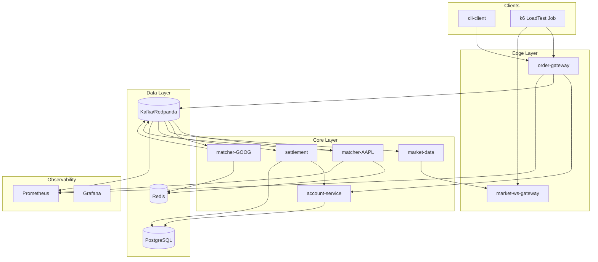
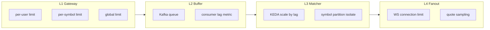
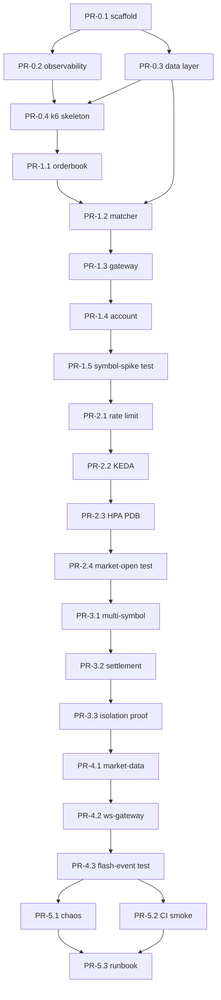

# A+ Stock Exchange — Implementation Plan

> **문서 목적**: 부하 제어·테스트·모니터링을 1순위 학습 목표로 하는 이벤트 기반 주식시장 시뮬레이터(A+안)의 구현 계획.
> 에이전트가 Phase/PR 단위로 직접 참조·실행할 수 있도록 작성됨.

**관련 문서**: [README.md](../README.md)

---

## 목차

1. [Project Charter](#1-project-charter)
2. [Architecture](#2-architecture)
3. [Technology Decisions](#3-technology-decisions)
4. [Repository Layout](#4-repository-layout)
5. [Service Specifications](#5-service-specifications)
6. [Event Schema](#6-event-schema)
7. [Observability Contract](#7-observability-contract)
8. [Load Test Integration](#8-load-test-integration)
9. [Phase / PR Implementation Plan](#9-phase--pr-implementation-plan)
10. [Agent Execution Notes](#10-agent-execution-notes)
11. [Burst Scenario Runbook](#11-burst-scenario-runbook)
12. [Risks and Mitigations](#12-risks-and-mitigations)
13. [Open Decisions](#13-open-decisions)

---

## 1. Project Charter

### 1.1 Primary Learning Goals (우선순위)

| 순위 | 목표 | 학습 내용 |
|------|------|-----------|
| 1 | **Load control** | 계층별 rate limit, backpressure, circuit breaker, autoscaling |
| 2 | **Load testing** | 종목 스파이크 / 시장 전체 스파이크 / flash-event를 K8s Job으로 재현 |
| 3 | **Monitoring** | 서비스별 + 심볼별 golden signals, SLO 대시보드, alert 규칙 |

### 1.2 Secondary Goals

- 가격·시간 우선 Limit Order 매칭 (단일/다중 심볼)
- 이벤트 기반 파이프라인: 주문 → 체결 → 정산 → 시세
- K8s 네이티브 운영: Helm, HPA, KEDA, NetworkPolicy, PDB

### 1.3 Non-Goals (v1)

- 실제 금융 규제/감사 준수
- 모바일/웹 UI (CLI + k6만 제공)
- Kubernetes Operator / CRD (C안 요소는 KEDA만 차용)
- 다중 AZ 프로덕션 HA (로컬 kind 클러스터 기준)

### 1.4 Success Criteria (SLO)

기준 클러스터: 3-node kind

| Scenario | SLO |
|----------|-----|
| Steady state 100 order/s | p99 end-to-end latency < 200ms |
| Symbol spike 1000 order/s (단일 종목, 30s) | reject rate < 5%, 비스파이크 종목 p99 < 300ms |
| Market-wide spike 500 order/s (전 종목) | Kafka lag가 스파이크 종료 후 60s 이내 회복 |
| Flash event (주문 + WS 구독 동시 폭증) | Gateway 429 활성화, OOMKill 없음 |

---

## 2. Architecture

### 2.1 High-Level Diagram



### 2.2 Control Layers (학습 핵심)

주식 시장 급등 트래픽은 단일 계층에서 제어할 수 없다. 아래 4계층 각각에서 독립적으로 제어·스케일·관측한다.



| 계층 | 종목 스파이크 (T2) | 전체 스파이크 (T3/T4) | 제어 수단 |
|------|-------------------|----------------------|-----------|
| L1 Gateway | 심볼별 rate limit | 글로벌 + per-user limit | Token bucket, HTTP 429 |
| L2 Kafka | 해당 파티션 lag 증가 | 전 파티션 lag | retention, consumer pause |
| L3 Matcher | 해당 symbol Pod만 부하 | 전 Matcher 부하 | KEDA (kafka lag), symbol partition |
| L4 WS Gateway | 해당 종목 구독자만 | 전 종목 팬아웃 | connection limit, quote sampling |

### 2.3 Traffic Scenarios

| ID | Name | Pattern | Expected bottleneck |
|----|------|---------|-------------------|
| T1 | `steady` | 100 order/s, uniform | none |
| T2 | `symbol-spike` | 1 symbol 10x for 30s | matcher partition + KEDA |
| T3 | `market-open` | all symbols 5x for 60s | gateway + kafka lag |
| T4 | `flash-event` | T3 + 500 WS subscribe/s | market-ws-gateway |

---

## 3. Technology Decisions

| Area | Choice | Rationale |
|------|--------|-----------|
| Language | **Go 1.22+** | K8s client 생태계, 낮은 latency, 학습 곡선 |
| Local K8s | **kind** | CI 친화, 멀티노드 구성 쉬움 |
| Messaging | **Redpanda** (Kafka API 호환) | 로컬 리소스 절약, Strimzi 대비 경량 |
| Cache | Redis 7 | 호가 스냅샷, rate-limit counter |
| DB | PostgreSQL 16 | 계좌·체결 이력 |
| Metrics | Prometheus + kube-prometheus-stack | HPA/KEDA 메트릭 연동 |
| Dashboards | Grafana | burst scenario 전용 보드 |
| Load test | k6 (v1: K8s Job) | 시나리오-as-code |
| Autoscale | HPA (CPU/RPS) + **KEDA** (kafka lag) | 계층별 스케일 정책 |
| Packaging | **Helm** (umbrella chart) | 서비스별 subchart |
| Dev loop | **Tilt** | 로컬 hot-reload |
| Ingress | nginx-ingress (kind) | rate limit annotation + app-level limit |

---

## 4. Repository Layout

```
stock-market/
├── README.md
├── docs/
│   └── IMPLEMENTATION_PLAN.md      # this document
├── proto/                          # optional; v1 uses JSON events
├── pkg/
│   ├── events/                     # event schemas + serde
│   ├── orderbook/                  # matching engine library
│   ├── metrics/                    # Prometheus helpers
│   └── ratelimit/                  # token bucket
├── services/
│   ├── order-gateway/
│   ├── matcher/
│   ├── market-data/
│   ├── market-ws-gateway/
│   ├── settlement/
│   ├── account-service/
│   └── cli-client/
├── loadtest/
│   ├── scenarios/
│   │   ├── steady.js
│   │   ├── symbol-spike.js
│   │   ├── market-open.js
│   │   └── flash-event.js
│   └── k8s/                        # Job/CronJob manifests
├── deploy/
│   ├── helm/
│   │   └── stock-exchange/         # umbrella chart
│   │       ├── charts/
│   │       │   ├── order-gateway/
│   │       │   ├── matcher/
│   │       │   └── ...
│   │       └── values.yaml
│   ├── kind/
│   │   └── cluster.yaml            # 3 control-plane + workers
│   └── tilt/
│       └── Tiltfile
├── observability/
│   ├── dashboards/
│   │   ├── golden-signals.json
│   │   └── burst-scenarios.json
│   └── alerts/
│       └── slo-rules.yaml
├── Makefile
└── .github/workflows/
    ├── ci.yaml
    └── load-smoke.yaml
```

---

## 5. Service Specifications

### 5.1 order-gateway

| 항목 | 내용 |
|------|------|
| Role | REST 주문 접수, 검증, rate limit, Kafka publish |
| Endpoints | `POST /v1/orders`, `DELETE /v1/orders/{id}`, `GET /v1/health`, `GET /metrics` |
| Rate limits | `global_rps`, `per_user_rps`, `per_symbol_rps` (ConfigMap) |
| 초과 응답 | HTTP 429 + `X-RateLimit-*` headers |
| K8s | Deployment, HPA (CPU 70%), min 2 replicas |
| Publishes | `orders.submitted` (key = symbol) |

### 5.2 matcher (per-symbol StatefulSet)

| 항목 | 내용 |
|------|------|
| Role | in-memory order book, price-time priority matching |
| Input | `orders.submitted` (consumer group `matcher-{symbol}`) |
| Output | `orders.matched`, `trades.executed` |
| State | in-memory primary, Redis snapshot (recovery) |
| K8s | StatefulSet per symbol (v1: AAPL, GOOG), KEDA on `kafka_consumer_lag` |
| Metrics | `matcher_orders_processed_total{symbol}`, `matcher_match_latency_seconds`, `matcher_book_depth{symbol}` |

### 5.3 market-data

| 항목 | 내용 |
|------|------|
| Role | aggregate trades/quotes, publish to WS topic |
| Input | `trades.executed`, `orders.matched` |
| Output | `market.trades`, `market.quotes` |
| K8s | Deployment, HPA on consumer lag proxy metric |

### 5.4 market-ws-gateway

| 항목 | 내용 |
|------|------|
| Role | WebSocket fanout to clients |
| Endpoint | `WS /v1/stream?symbols=AAPL,GOOG` |
| Controls | max connections per IP, per-symbol subscription cap, quote sampling under load |
| K8s | Deployment, HPA on active connections metric |
| Metrics | `ws_active_connections`, `ws_messages_sent_total{symbol}`, `ws_backpressure_drops_total` |

### 5.5 settlement

| 항목 | 내용 |
|------|------|
| Role | T+0 virtual settlement, position update |
| Input | `trades.executed` |
| Output | `positions.updated` |
| K8s | Deployment (consumer), 1-2 replicas, idempotent processing |

### 5.6 account-service

| 항목 | 내용 |
|------|------|
| Role | balances, positions, order pre-check |
| Storage | PostgreSQL |
| Internal API | `GET /internal/accounts/{user}/balance`, `POST /internal/accounts/{user}/reserve` |
| K8s | Deployment + PVC, readiness on DB |

### 5.7 cli-client

| 항목 | 내용 |
|------|------|
| Role | manual testing (submit order, watch stream) |
| K8s | Job or local binary |

---

## 6. Event Schema

v1은 JSON 사용. 가격은 float 회피를 위해 **cents 정수(int64)** 사용.

### 6.1 orders.submitted

```json
{
  "event_id": "uuid",
  "order_id": "uuid",
  "user_id": "string",
  "symbol": "AAPL",
  "side": "BUY",
  "type": "LIMIT",
  "price": 15000,
  "qty": 10,
  "timestamp": "2026-06-21T09:30:00Z"
}
```

### 6.2 orders.matched

```json
{
  "event_id": "uuid",
  "order_id": "uuid",
  "symbol": "AAPL",
  "matched_qty": 5,
  "remaining_qty": 5,
  "status": "PARTIAL",
  "timestamp": "2026-06-21T09:30:00Z"
}
```

### 6.3 trades.executed

```json
{
  "trade_id": "uuid",
  "symbol": "AAPL",
  "price": 15000,
  "qty": 5,
  "buy_order_id": "uuid",
  "sell_order_id": "uuid",
  "timestamp": "2026-06-21T09:30:01Z"
}
```

### 6.4 Kafka Topics

| Topic | Partitions (v1) | Key | Retention |
|-------|-----------------|-----|-----------|
| orders.submitted | 8 (symbol hash) | symbol | 24h |
| orders.matched | 8 | symbol | 24h |
| trades.executed | 8 | symbol | 7d |
| market.trades | 8 | symbol | 1h |
| market.quotes | 8 | symbol | 1h |
| positions.updated | 4 | user_id | 7d |

---

## 7. Observability Contract

### 7.1 Golden Signals (per service)

| Signal | Metric pattern |
|--------|----------------|
| Latency | histogram `*_duration_seconds` |
| Traffic | counter `*_requests_total` or `*_messages_total` |
| Errors | counter `*_errors_total{reason}` |
| Saturation | gauge `*_queue_depth`, `kafka_consumer_lag`, `go_goroutines` |

### 7.2 Symbol-Level Labels

Matcher, gateway, market-data 메트릭은 가능한 경우 **`symbol` label 필수**.

### 7.3 Grafana Dashboards

| Dashboard | Purpose |
|-----------|---------|
| `golden-signals.json` | 서비스 overview, RED method |
| `burst-scenarios.json` | T2/T3/T4 overlay: RPS, p99, lag, replica count, 429 rate |

### 7.4 Alert Rules (Prometheus)

| Alert | Condition |
|-------|-----------|
| `KafkaConsumerLagHigh` | lag > 1000 for 2m |
| `GatewayRejectRateHigh` | 429 rate > 10% for 1m |
| `MatcherLatencySLO` | p99 > 500ms for 3m |
| `PodOOMKilled` | any OOM in exchange namespace |

---

## 8. Load Test Integration

### 8.1 k6 Scenarios (`loadtest/scenarios/`)

각 시나리오가 export하는 커스텀 메트릭:

- `orders_submitted_rate`
- `orders_rejected_rate`
- `end_to_end_latency` (WS 또는 poll 기반)

### 8.2 K8s Execution

`loadtest/k8s/` 아래에 시나리오별 Job manifest:

- `steady-job.yaml`
- `symbol-spike-job.yaml`
- `market-open-job.yaml`
- `flash-event-job.yaml`

### 8.3 CI Smoke

`.github/workflows/load-smoke.yaml`:

1. kind 클러스터 생성
2. Helm chart deploy
3. `steady.js` at 10 order/s for 60s
4. assert p99 < 500ms

---

## 9. Phase / PR Implementation Plan

### Phase 0 — Platform Foundation (Week 1)

| PR | Branch/Title | Tasks | Exit check |
|----|--------------|-------|------------|
| PR-0.1 | `chore: scaffold repo layout + Makefile` | Makefile targets (`kind-up`, `kind-down`, `helm-install`, `tilt-up`), kind 3-node cluster config | `make kind-up` succeeds |
| PR-0.2 | `feat: deploy observability stack` | kube-prometheus-stack Helm values, Grafana dashboard shells, ServiceMonitor CRD pattern | Grafana accessible |
| PR-0.3 | `feat: deploy data layer` | Redpanda, Redis, PostgreSQL subcharts, NetworkPolicy | pods healthy in exchange namespace |
| PR-0.4 | `feat: k6 loadtest skeleton` | `steady.js` + mock HTTP server, Prometheus scrapes k6 metrics | k6 Job completes |

**Phase 0 exit gate**: `make kind-up && make helm-install` → infra + Grafana up; k6 Job completes.

---

### Phase 1 — Single Symbol Pipeline (Week 2-3)

| PR | Branch/Title | Tasks | Exit check |
|----|--------------|-------|------------|
| PR-1.1 | `feat: pkg/orderbook matching engine` | Limit order, price-time priority, partial fill, cancel, table-driven unit tests | `go test ./pkg/orderbook/...` pass |
| PR-1.2 | `feat: matcher service (AAPL only)` | Kafka consumer/producer, in-memory book, `/metrics`, match latency histogram | matcher processes orders |
| PR-1.3 | `feat: order-gateway v1` | POST /v1/orders, Kafka publish, basic validation (no rate limit yet) | curl POST returns 202 |
| PR-1.4 | `feat: account-service v1` | Seed users, balance check, reserve on submit | insufficient balance rejected |
| PR-1.5 | `test: symbol-spike scenario (matcher path)` | k6 → gateway → kafka → matcher, Grafana panel for latency + lag | T1 pass; T2 visible on dashboard |

**Phase 1 exit gate**: T1 steady 100 order/s passes; T2 symbol-spike visible on dashboard.

---

### Phase 2 — Load Control Layer (Week 4)

| PR | Branch/Title | Tasks | Exit check |
|----|--------------|-------|------------|
| PR-2.1 | `feat: gateway rate limiting` | `pkg/ratelimit` token bucket, ConfigMap limits, 429 metrics, integration tests | 429 rate metric non-zero under load |
| PR-2.2 | `feat: KEDA scaler for matcher` | ScaledObject on kafka lag per symbol | replicas scale up on T2 |
| PR-2.3 | `feat: gateway HPA + PDB` | min 2 replicas, PDB minAvailable 1 | pod kill during T3, no downtime |
| PR-2.4 | `test: market-open scenario` | T3 script + Job manifest, verify 429 + lag recovery | lag recovers < 60s |

**Phase 2 exit gate**: T3 completes without OOM; lag recovers < 60s.

---

### Phase 3 — Multi-Symbol + Isolation (Week 5)

| PR | Branch/Title | Tasks | Exit check |
|----|--------------|-------|------------|
| PR-3.1 | `feat: matcher StatefulSet templating (Helm)` | Parametrize symbols `[AAPL, GOOG]`, per-symbol consumer group | both matchers running |
| PR-3.2 | `feat: settlement + positions` | Consume trades.executed, update PostgreSQL | positions reflect trades |
| PR-3.3 | `test: symbol-spike isolation proof` | T2 on AAPL only; assert GOOG p99 unaffected | GOOG p99 < 300ms during AAPL spike |

**Phase 3 exit gate**: T2 spike on AAPL, GOOG p99 stays < 300ms.

---

### Phase 4 — Market Data + WS Fanout (Week 6)

| PR | Branch/Title | Tasks | Exit check |
|----|--------------|-------|------------|
| PR-4.1 | `feat: market-data service` | Publish market.trades, market.quotes | topics receive events |
| PR-4.2 | `feat: market-ws-gateway` | WebSocket stream, connection limits, sampling under load | WS clients receive quotes |
| PR-4.3 | `test: flash-event scenario` | T4 combined load, validate `ws_backpressure_drops_total` | no pod crash; backpressure metrics non-zero |

**Phase 4 exit gate**: T4 runs without pod crash; backpressure metrics validated.

---

### Phase 5 — Hardening + CI (Week 7)

| PR | Branch/Title | Tasks | Exit check |
|----|--------------|-------|------------|
| PR-5.1 | `feat: chaos tests (manual)` | `kubectl delete pod` on matcher during T2; assert recovery | matcher recovers, no data loss |
| PR-5.2 | `ci: load smoke workflow` | kind in GHA, steady.js smoke | CI green |
| PR-5.3 | `docs: burst scenario runbook` | Section 11 runbook 완성, README 업데이트 | all T1-T4 documented |

**Phase 5 exit gate**: CI green; all T1-T4 documented with commands.

---

## 10. Agent Execution Notes

### 10.1 Makefile Targets (to be created in PR-0.1)

```bash
make kind-up          # create 3-node kind cluster
make kind-down        # delete cluster
make deps             # add helm repos
make install-infra    # redpanda, redis, postgres, prometheus, keda
make install-apps     # exchange services
make tilt-up          # dev loop with hot-reload
make test-steady      # k6 steady scenario
make test-symbol-spike
make test-market-open
make test-flash-event
```

### 10.2 PR Workflow Rules

1. Section 9의 PR **한 행 = PR 하나**
2. 각 PR 포함 항목: 코드 + Helm values + dashboard diff (메트릭 추가 시) + test scenario update
3. Merge 전 필수: `go test ./...` + 해당 phase k6 smoke
4. 새 메트릭 추가 시 `observability/dashboards/` 동시 업데이트

### 10.3 Config Knobs for Experiments

| Knob | Location | Purpose |
|------|----------|---------|
| `gateway.globalRps` | `deploy/helm/stock-exchange/values.yaml` | L1 global throttle |
| `gateway.perSymbolRps` | values.yaml | T2 symbol limit test |
| `keda.lagThreshold` | matcher subchart values | scale trigger sensitivity |
| `ws.maxConnections` | ws-gateway subchart values | T4 fanout limit |
| `k6.vus` | `loadtest/scenarios/*.js` | spike intensity |

### 10.4 Phase 진행 시 에이전트 체크리스트

```
[ ] 이전 Phase exit gate 통과 확인
[ ] 현재 PR scope만 구현 (drive-by refactor 금지)
[ ] Helm values 기본값이 로컬 kind에서 동작하는지 확인
[ ] 새 env var는 ConfigMap/Secret으로 문서화
[ ] loadtest 시나리오 또는 CI smoke 업데이트
[ ] Grafana dashboard 패널 추가 (메트릭 변경 시)
```

---

## 11. Burst Scenario Runbook

> Phase 5 (PR-5.3)에서 상세화. 아래는 실행 골격.

### 11.1 Prerequisites

```bash
make kind-up
make install-infra
make install-apps
# Grafana: kubectl port-forward -n monitoring svc/prometheus-grafana 3000:80
```

### 11.2 T1 — Steady

```bash
make test-steady
```

**관측 포인트**: 전 서비스 p99 < 200ms, kafka lag ≈ 0, HPA replica 변동 없음.

### 11.3 T2 — Symbol Spike

```bash
make test-symbol-spike
# 또는: kubectl apply -f loadtest/k8s/symbol-spike-job.yaml
```

**관측 포인트**:
- `matcher_match_latency_seconds{symbol="AAPL"}` p99 상승
- `kafka_consumer_lag` AAPL 파티션만 spike
- KEDA가 matcher-AAPL replica 증가
- GOOG 메트릭은 안정

### 11.4 T3 — Market Open

```bash
make test-market-open
```

**관측 포인트**:
- `gateway_requests_total{status="429"}` 증가
- 전 파티션 kafka lag spike → 60s 내 회복
- HPA gateway replica 증가

### 11.5 T4 — Flash Event

```bash
make test-flash-event
```

**관측 포인트**:
- `ws_active_connections` 급증
- `ws_backpressure_drops_total` > 0 (극한 설정 시)
- OOMKill 이벤트 없음

### 11.6 Chaos (수동)

```bash
# T2 실행 중
kubectl delete pod -n exchange -l app=matcher,symbol=AAPL
# 기대: 새 pod 기동, kafka lag 일시 증가 후 회복, 유실 주문 없음
```

---

## 12. Risks and Mitigations

| Risk | Impact | Mitigation |
|------|--------|------------|
| Local machine OOM under T3/T4 | 테스트 실패 | kind resource limits; 초기 RPS를 목표의 1/5로 시작 |
| Redpanda single broker lag | Phase 3 병목 | Phase 1부터 lag 모니터링; Phase 3 전 partition 수 증가 |
| Float price bugs | 체결 오류 | int64 cents everywhere, JSON schema validation |
| KEDA install complexity | Phase 2 지연 | Makefile에 helm install 자동화; chart version pin |
| Redis snapshot race | matcher 재시작 시 상태 불일치 | snapshot + kafka offset 함께 저장; idempotent replay |

---

## 13. Open Decisions

| Decision | v1 Choice | Alternative (later) |
|----------|-----------|---------------------|
| Message broker | Redpanda | Strimzi Kafka |
| Event format | JSON | Protobuf (`proto/` dir reserved) |
| Service mesh | None | Linkerd/Istio for mTLS |
| Symbols | AAPL, GOOG (Helm values) | Dynamic via CRD/Operator |
| k6 operator | K8s Job | Grafana k6 operator |

---

## Appendix: PR Dependency Graph



---

*Last updated: 2026-06-21*