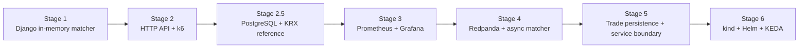
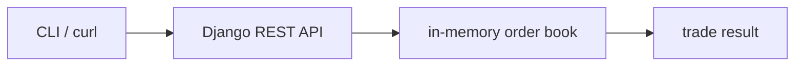

# A+ Stock Exchange — Incremental Learning Plan

> **문서 목적**: 이벤트 기반 주식시장 시뮬레이터를 만들면서, 필요한 문제를 먼저 관찰하고 그 문제를 해결하는 기술을 **한 단계씩** 도입한다.
>
> 처음부터 마이크로서비스와 Kubernetes를 구성하지 않는다. 각 단계의 exit gate를 통과한 뒤에만 다음 기술을 추가한다.

**관련 문서**: [README.md](../README.md) · [UBUNTU_SETUP.md](./UBUNTU_SETUP.md)

---

## 1. 학습 원칙

1. **기능 → 측정 → 병목 → 기술 도입** 순서를 지킨다.
2. 한 PR은 한 가지 학습 질문에만 답한다. drive-by refactor는 하지 않는다.
3. 새 인프라는 직전 단계에서 관찰한 한계를 해결할 때만 도입한다.
4. 모든 단계는 로컬에서 재현 가능하고, 테스트 또는 부하 측정 결과로 완료를 판단한다.
5. 가격은 항상 원화 정수(`int64`)로 다룬다. `float`는 사용하지 않는다.

### 1.1 최종 학습 목표

| 우선순위 | 목표 | 도달 방식 |
|---|---|---|
| 1 | 주문 매칭 원리 이해 | 단일 Django 프로세스의 가격·시간 우선 order book |
| 2 | 부하와 병목 이해 | k6로 RPS·지연시간·오류율을 재현하고 비교 |
| 3 | 관측 가능성 이해 | Prometheus/Grafana로 RED 지표와 queue lag 확인 |
| 4 | 비동기 처리·backpressure 이해 | 실제 동기 경로의 한계가 확인된 뒤 Redpanda 도입 |
| 5 | K8s autoscaling·격리 이해 | 서비스와 queue가 필요한 상태에서 kind/Helm/KEDA 도입 |

### 1.2 초기에는 하지 않는 것

- Kubernetes, Helm, KEDA, HPA, PDB, NetworkPolicy
- Redpanda/Kafka, Redis, WebSocket, trading-bot
- 다종목 분리와 마이크로서비스화

이 항목들은 제거한 것이 아니라, 각 항목이 해결할 실제 문제가 생긴 뒤의 단계로 미룬다.

---

## 2. 목표 아키텍처의 진화



### 2.1 Stage 1의 유일한 런타임 구조



시작 종목은 `005930` 하나이며, 기준 가격은 고정된 개발용 시드 값으로 둔다. 이 단계에서는 데이터베이스나 메시지 브로커가 없다.

---

## 3. 단계별 구현 계획

### Stage 0 — Django/DRF 개발 기반 정리

**학습 질문**: 가장 작은 Django REST API를 반복 실행·검증할 수 있는가?

| PR | 작업 | 완료 조건 |
|---|---|---|
| S0.1 | `backend/` Django project와 `exchange` app, DRF health API 구성 | `GET /api/v1/health/`가 200 반환 |
| S0.2 | 가상환경·requirements·Makefile에 `setup`, `migrate`, `test`, `run` 명령 구성 | `make backend-test`, `make backend-run` 성공 |

**기술**: Python 3.12, Django, Django REST Framework, SQLite, Makefile.

### Stage 1 — 단일 프로세스 매칭 엔진

**학습 질문**: 가격·시간 우선 체결과 부분 체결을 올바르게 구현할 수 있는가?

| PR | 작업 | 완료 조건 |
|---|---|---|
| S1.1 | `backend/exchange/orderbook/`: limit order, price-time priority, partial fill | Django unit test 성공 |
| S1.2 | 취소와 잔량 조회, 잘못된 주문 검증 | cancel·edge case test 성공 |
| S1.3 | DRF `POST /api/v1/orders/`: 고정 시드 `005930`을 가진 주문 API | 체결 결과 또는 잔량을 반환 |

**API 최소 계약**:

```json
POST /api/v1/orders/
{
  "user_id": "alice",
  "symbol": "005930",
  "side": "BUY",
  "price": 70000,
  "qty": 10
}
```

- 응답: 주문 ID, 체결 목록, 남은 수량
- 보조 엔드포인트: `GET /api/v1/health/`, `GET /api/v1/books/005930/`

**Exit gate**: 서로 교차하는 매수·매도 주문이 기대 가격과 시간 순서로 체결되고, `make backend-test`가 통과한다.

### Stage 1.6 — 재현 가능한 참여자 데모

**학습 질문**: 같은 거래 참여자 조건을 반복 실행해, 다음 Stage의 부하 측정 기준선을 만들 수 있는가?

| 작업 | 완료 조건 |
|---|---|
| 결정론적 `seed_traders` 명령 | 같은 count·seed에서 같은 프로필을 upsert |
| Compose runner 환경 설정 | 개인 `.env`의 runner 범위를 컨테이너에 주입 |
| TTL 취소 idempotency | 체결된 주문의 지연 취소가 오류 로그를 만들지 않음 |
| runner 상태 요약 | tick·제출·취소·이미 종료된 주문·실패 수 확인 |
| demo runbook | backend, seed, runner, 종료 순서를 한 번에 재현 |

**Kubernetes 경계**: backend와 runner는 모두 replica 1개만 허용한다. in-memory order book 또는 profile sharding 문제가 해결되기 전에는 HPA/다중 replica를 사용하지 않는다. 자세한 계약은 [DEMO_RUNBOOK.md](./DEMO_RUNBOOK.md)에 둔다.

**Exit gate**: 빈 Docker 환경에서 `make demo-up`, `make demo-seed`, `make demo-runner-up`으로 같은 참여자 흐름을 재현하고, `make backend-test`, `make participant-runner-test`가 통과한다.

### Stage 2 — 부하 생성과 기본 보호

**학습 질문**: 부하가 증가할 때 처리량, 지연 시간, 실패율은 어떻게 달라지는가?

| PR | 작업 | 완료 조건 |
|---|---|---|
| S2.1 | k6 `steady` 시나리오: 단일 종목에 일정 주문률 전송 | 로컬에서 결과 재현 가능 |
| S2.2 | 응답 시간과 오류율을 k6 summary로 기록 | 10·50·100 order/s 비교 표 작성 |
| S2.3 | Django middleware 기반 메모리 토큰 버킷 global rate limit | 한도 초과 시 HTTP 429 및 `Retry-After` 반환 |
| S2.4 | `symbol-spike` 시나리오: 005930에 30초간 급증 | 429 비율과 p95/p99를 확인 가능 |

**처음 측정할 지표**: 요청 수, HTTP 상태별 오류율, p50/p95/p99 latency, process CPU·메모리.

**Exit gate**: `make load-steady`와 `make load-symbol-spike`가 실행되고, rate limit 유무에 따른 결과 차이를 설명할 수 있다.

### Stage 2.5 — PostgreSQL과 KRX 참조 데이터

**학습 질문**: 정규장 자동 운영에 필요한 종목 풀과 기준가를 외부 참조 데이터에서 안전하고 재현 가능하게 준비할 수 있는가?

| PR | 작업 | 완료 조건 |
|---|---|---|
| S2.5.1 | Compose PostgreSQL과 Django 연결 | migration·재시작 후 데이터 보존 |
| S2.5.2 | KRX client와 `Symbol`, `MarketDaily`, `ReferenceImportRun` | fixture parsing과 실패 이력 테스트 성공 |
| S2.5.3 | KOSPI 거래대금 상위 100개 원자적 upsert | 동일 날짜 재실행 시 정확히 100개 유지 |
| S2.5.4 | 실제 KRX 최근 확정 거래일 적재 | API 활용승인 후 PostgreSQL에서 100개 확인 |

주문·체결 상태는 계속 메모리에 둔다. PostgreSQL 도입은 참조 데이터와 트레이더 설정의 영속화를 위한 것이며, matcher 수평 확장을 의미하지 않는다.

**Exit gate**: `make import-krx-top100`이 최근 확정 KOSPI 상위 100개를 저장하고, 키가 로그나 저장소에 노출되지 않는다.

**상태**: 2026-07-28 완료. 최근 확정 거래일 2026-07-27의 100개를 적재했고, 동일 날짜 재실행과 PostgreSQL 재시작 후에도 100개가 유지되는 것을 확인했다.

### Stage 3 — 애플리케이션 관측성

**학습 질문**: k6 결과 밖에서도 서비스가 왜 느려졌는지 알 수 있는가?

| PR | 작업 | 완료 조건 |
|---|---|---|
| S3.1 | `/metrics`와 Python Prometheus client 도입 | request count/duration, orders, rejects 노출 |
| S3.2 | Docker Compose로 앱 + Prometheus + Grafana 실행 | 한 명령으로 로컬 대시보드 기동 |
| S3.3 | 단일 Golden Signals 대시보드 | RPS, p99, 429 rate, Python process/메모리 확인 |

**필수 메트릭**:

- `http_requests_total{route,status}`
- `http_request_duration_seconds{route}`
- `orders_submitted_total{symbol,side}`
- `orders_rejected_total{reason}`
- `orderbook_depth{symbol,side}`

**Exit gate**: Stage 2 부하 테스트 중 Grafana에서 RPS, p99, 429 비율, 호가 잔량 변화를 함께 확인한다.

### Stage 4 — 비동기 처리와 queue backpressure

**도입 조건**: Stage 3에서 동기 주문 처리의 p99 악화, 처리량 한계, 또는 요청 고립 실패를 실제로 확인했을 때만 시작한다.

**학습 질문**: 요청 수락과 매칭 처리를 분리하면 어떤 이점과 새로운 비용(queue lag)이 생기는가?

| PR | 작업 | 완료 조건 |
|---|---|---|
| S4.1 | Docker Compose에 Redpanda 1 broker 추가 | topic 생성·로컬 연결 확인 |
| S4.2 | gateway는 주문을 publish, matcher는 consume | 주문이 비동기로 체결됨 |
| S4.3 | consumer lag와 처리 지연 메트릭 추가 | spike 뒤 lag 회복 시간을 측정 |
| S4.4 | 재시도·idempotency의 최소 구현 | 중복 이벤트가 중복 체결되지 않음 |

**Exit gate**: spike 후 queue lag가 측정되고 회복 시간을 비교할 수 있다. 이전 동기 구조 대비 장점과 복잡도를 문서화한다.

### Stage 5 — 영속화와 서비스 경계

**도입 조건**: 프로세스 재시작 시 주문/체결 이력이 사라지는 것이 다음 실험을 방해할 때만 시작한다.

**학습 질문**: 상태를 영속화하고 서비스를 분리할 때 일관성과 운영 복잡도는 어떻게 달라지는가?

| PR | 작업 | 완료 조건 |
|---|---|---|
| S5.1 | 기존 PostgreSQL에 trades/orders 최소 이력 저장 | 재시작 후 체결 이력 조회 가능 |
| S5.2 | account reserve 또는 settlement 중 하나만 분리 | 잔고 부족 주문이 거절됨 |
| S5.3 | 두 번째 종목 `035420` 추가 | 종목별 지표를 비교 가능 |
| S5.4 | 저장된 KRX 종목 풀을 matcher 기준가에 연결 | 두 종목의 seed price 적재 |

Redis, WebSocket, trading-bot은 이 단계에서도 필요성이 확인될 때만 별도 PR로 추가한다.

**Exit gate**: 재시작 후 필요한 이력이 보존되고, `005930` spike가 `035420` 지표에 미치는 영향을 측정할 수 있다.

### Stage 6 — Kubernetes와 autoscaling

**도입 조건**: Docker Compose 환경에서 gateway와 matcher가 분리되어 있고, queue lag 기반 확장이라는 구체적 실험 질문이 준비됐을 때만 시작한다.

**학습 질문**: 컨테이너 오케스트레이션과 autoscaling이 실제 부하 제어에 어떤 효과를 주는가?

| PR | 작업 | 완료 조건 |
|---|---|---|
| S6.1 | kind + Helm으로 현재 Compose 구성을 그대로 배포 | 모든 서비스가 kind에서 기동 |
| S6.2 | gateway HPA와 resource requests/limits | 부하 시 replica 변화를 관측 |
| S6.3 | matcher의 Redpanda lag 메트릭과 KEDA | spike 시 scale-out 확인 |
| S6.4 | 두 종목 격리 실험 | 005930 spike 중 035420 p99 목표 유지 |
| S6.5 | PDB, NetworkPolicy, chaos test | pod 재시작 후 recovery 관측 |

**Exit gate**: 종목 spike에서 gateway의 제한, queue lag, matcher replica 수, 다른 종목 p99를 하나의 대시보드에서 비교한다.

---

## 4. 부하 시나리오의 성장

| 시나리오 | 최초 도입 | 내용 | 다음 단계로 넘어가기 위한 관찰 |
|---|---|---|---|
| T1 `steady` | Stage 2 | 10 → 50 → 100 order/s | latency가 어느 지점에서 증가하는가 |
| T2 `symbol-spike` | Stage 2 | 한 종목 30초 급증 | rate limit이 서비스 보호에 충분한가 |
| T3 `queue-recovery` | Stage 4 | queue 적체 후 입력 정상화 | lag가 얼마나 빨리 회복되는가 |
| T4 `symbol-isolation` | Stage 5/6 | 005930만 spike | 035420의 latency가 유지되는가 |
| T5 `flash-event` | 필요 시 | 주문 급증 + WS 구독 증가 | fanout 제어가 정말 필요한가 |

처음에는 T1/T2만 구현한다. T3~T5는 필요한 구성요소가 도입된 후에만 추가한다.

---

## 5. 기술 도입 판단 기록

새 기술을 추가하는 PR에는 아래 질문의 답을 README 또는 PR 설명에 남긴다.

1. 현재 구조에서 관찰한 문제는 무엇인가? (측정값 포함)
2. 왜 더 단순한 해결책으로는 충분하지 않은가?
3. 새 기술이 해결할 가설은 무엇인가?
4. 도입 성공/실패를 어떤 지표로 판단할 것인가?
5. 새로 생기는 운영·테스트 비용은 무엇인가?

예: Redpanda 도입 전에는 “100 order/s에서 동기 matcher p99가 X ms이고, 매칭 지연이 HTTP 요청을 점유한다”는 근거를 먼저 남긴다.

---

## 6. 현재 상태와 다음 작업

기존 PR-0.1/0.2에서 kind, Makefile, Prometheus/Grafana용 파일이 추가되어 있다. 이는 나중 Stage 3/6에서 재사용할 수 있지만, **현재 학습 진행 기준은 Stage 0부터 다시 시작**한다.

S0.1/S0.2, Stage 1의 단일 프로세스 매칭 엔진, Stage 1.5의 외부 participant-runner와 4개 트레이더 전략, Stage 1.6의 재현 가능한 데모 환경, S2.1/S2.2의 k6 steady 기준 측정, Stage 2.5의 PostgreSQL·KRX KOSPI 상위 100개 적재는 완료됐다. 모든 트레이더는 external runner에서만 실행한다. 다음 작업은 **S2.3/S2.4의 rate limit·spike 실험** 또는 정규장 세션 자동화 설계 중 하나를 선택해 진행한다.

완료 기준:

```bash
make backend-setup
make backend-test
```

가 성공하고, `GET /api/v1/health/`가 200을 반환해야 한다. 로컬 단위 테스트는 SQLite를 사용할 수 있지만 Compose backend는 PostgreSQL을 사용한다. 프론트엔드는 독립된 `frontend/` 디렉터리에 두며, 아직 앱을 생성하지 않는다.

---

## 7. 나중에 도입할 항목 목록

| 기술/기능 | 가장 이른 도입 단계 | 도입 근거 |
|---|---:|---|
| k6 | Stage 2 | 부하를 수치로 재현 |
| PostgreSQL | Stage 2.5 | KRX 참조 데이터와 설정 영속화 |
| KRX Open API | Stage 2.5 | KOSPI 종목 풀과 최근 확정 종가 |
| Prometheus/Grafana | Stage 3 | 서비스 내부 원인 관측 |
| Docker Compose | Stage 1.6 | backend·runner·PostgreSQL 반복 실행 |
| Redpanda | Stage 4 | 비동기 처리와 lag 학습 |
| Redis | Stage 5 이후 | snapshot/cache 문제가 실제로 생길 때 |
| WebSocket | Stage 5 이후 | 시세 fanout을 실험할 때 |
| kind/Helm/HPA/KEDA | Stage 6 | 오케스트레이션·autoscaling 실험 |

---

*Last updated: 2026-07-28 — PostgreSQL + KRX reference data 단계 반영*
