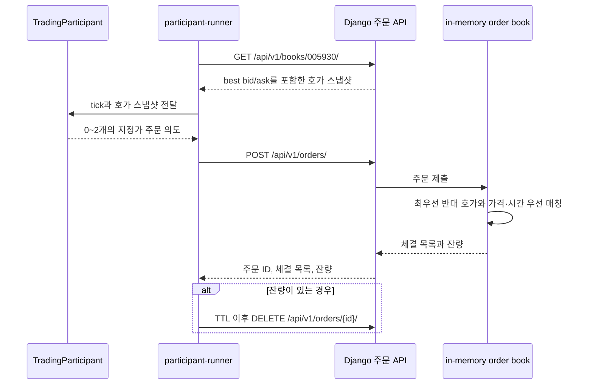

# 프로젝트 개요

## 목적

이 프로젝트는 주식 거래소의 주문 접수와 체결 과정을 작은 규모로 구현하고, 거래 요청이 늘어날 때 백엔드가 어떤 부하를 받는지 단계적으로 학습하기 위한 실습 프로젝트다.

처음부터 여러 서비스나 복잡한 인프라를 구성하지 않는다. 현재는 단일 Django 애플리케이션에서 주문 매칭의 기본 동작을 만들고, 별도 프로세스의 가상 시장참여자가 HTTP API를 통해 거래하도록 구성했다. 이후 부하를 측정해 실제로 확인된 문제를 근거로 다음 기술을 도입한다.

## 현재 구현 범위

### 거래소 API와 매칭 엔진

- Django와 Django REST Framework 기반의 HTTP API
- 상태 확인 API: `GET /api/v1/health/`
- 주문 제출·취소 API와 호가창 조회 API
- 개발용 단일 종목 `005930` 지원
- 지정가 주문, 가격·시간 우선, 부분 체결, 주문 잔량 및 취소 처리
- 체결 발생 시 backend 표준 출력에 체결 정보 기록

호가창과 주문 상태는 현재 backend 프로세스 메모리에 있다. 따라서 backend를 재시작하면 호가창은 초기화되며, 여러 matcher 인스턴스로 수평 확장하는 구조는 아직 구현하지 않았다.

### 주문 체결과 트레이더의 상호작용

현재 매칭 엔진은 한 종목에 대해 동작하는 **지정가 주문 기반의 연속경매 호가창**이다. 매수 주문은 가격이 높은 순서, 매도 주문은 가격이 낮은 순서로 정렬한다. 같은 가격에서는 먼저 호가창에 들어온 주문이 우선한다.

주문 하나가 들어오면 엔진은 반대편의 최우선 호가부터 다음 조건이 유지되는 동안 체결한다.

- 매수 지정가가 최우선 매도 호가보다 크거나 같을 때 체결한다.
- 매도 지정가가 최우선 매수 호가보다 작거나 같을 때 체결한다.
- 체결 가격은 먼저 호가창에 있던 주문(maker)의 가격을 사용한다.
- 체결 수량은 들어온 주문의 잔량과 상대 주문의 잔량 중 작은 값이다. 따라서 한 주문은 여러 상대 주문과 나누어 체결될 수 있고, 부분 체결도 가능하다.
- 더 이상 가격 조건이 맞지 않거나 들어온 주문이 모두 체결되면 처리를 끝낸다. 들어온 주문의 잔량이 있으면 해당 주문은 호가창에 남아 이후 주문의 상대 호가가 된다.

예를 들어 70,000원 매도 5주가 호가창에 있을 때, 71,000원 매수 3주가 들어오면 70,000원에 3주가 체결되고 매도 주문은 2주가 남는다. 이는 들어온 주문의 가격이 아니라 기존 매도 호가인 70,000원을 체결 가격으로 사용한 결과다.

모든 트레이더는 `participant-runner`에서만 실행된다. Django 내부 background 실행 경로는 사용하지 않으며, runner는 시작 시 활성화된 트레이더 프로필을 조회한다. 매 tick마다 종목별 호가 스냅샷을 한 번 읽고 전략에 전달한다.

현재 구현된 전략은 다음 네 가지다.

- `NoiseTrader`: seed 기반으로 방향·기준가 주변 가격·수량을 무작위 생성한다.
- `MomentumTrader`: 직전 midpoint보다 상승하면 최우선 매도호가에 매수하고, 하락하면 최우선 매수호가에 매도한다.
- `MeanReversionTrader`: midpoint가 기준가에서 한 호가 이상 낮으면 매수하고, 한 호가 이상 높으면 매도한다.
- `LiquidityProvider`: midpoint를 중심으로 한 호가 아래 매수와 한 호가 위 매도를 함께 낸다.

각 트레이더는 `interval_ticks` 주기마다 한 번만 주문 의도를 만든다. runner는 이 의도를 실제 HTTP 주문 API로 전송하고, 응답의 잔량이 0보다 큰 주문 ID만 자체 메모리에 추적한다. 추적된 주문은 `order_ttl_ticks`가 지나면 취소 API로 제거한다. 그 사이 다른 주문과 체결되어 이미 사라진 주문은 `ALREADY_CLOSED`로 처리하며, 정상적인 경쟁 상황으로 집계한다.

여기서 midpoint는 `(best bid + best ask) / 2`의 정수값이며 한쪽 호가만 있으면 그 가격, 호가가 없으면 프로필 기준가를 사용한다. 현재 API에는 체결가 이력이 없으므로 Momentum은 체결가가 아니라 이 midpoint의 tick 간 변화를 사용한다. 잔고·보유 수량·증거금 검증도 아직 없으므로, 현재 체결은 주문 우선순위와 수량 변화만 모사한다.

### 가상 시장참여자

- 네 가지 전략을 사용하는 트레이더 프로필 관리 API
- 주문 가격 범위, 수량, 제출 주기, 주문 유효 tick 등 트레이더별 설정
- 결정론적으로 트레이더 프로필을 생성·갱신하는 `seed_traders` 명령
- backend와 분리된 `participant-runner` 프로세스/컨테이너
- runner가 HTTP로 주문과 TTL 취소를 보내고, 주기적으로 제출·취소·실패 현황을 출력

트레이더 프로필은 주문 행동을 정의하는 설정 데이터다. 아직 현금, 보유 종목, 잔고 검증, 결제 기능은 포함하지 않는다.

### KRX 참조 데이터

- 별도 PostgreSQL 컨테이너에 종목·일별 데이터와 수집 실행 이력 저장
- KRX 유가증권 일별매매정보에서 최근 확정 거래일 탐색
- KOSPI 거래대금 상위 100개와 종가·거래량·거래대금·순위 적재
- 동일 거래일 재실행 시 중복 없이 정확히 100개 유지
- API 키와 PostgreSQL 자격정보를 Git·Docker build context에서 제외

KRX 종목 풀은 아직 주문 API와 메모리 호가창에 연결하지 않았다. 현재 matcher는 계속 개발용 단일 종목 `005930`만 처리한다.

### 실행 환경과 검증

- backend와 participant-runner를 각각 독립 Docker 이미지로 패키징
- Docker Compose로 backend만 또는 runner 포함 데모 실행
- backend 컨테이너 자원 제한: CPU 1개, 메모리 4GiB
- PostgreSQL 데이터는 Docker volume에 유지하며, 트레이더 프로필과 KRX 참조 데이터는 재시작 뒤에도 남음
- backend 단위 테스트와 participant-runner 단위 테스트 제공
- 동일한 입력을 재현하는 데모 실행 절차 제공

## 현재 상태

기본 거래 기능, 가상 시장참여자, 컨테이너 기반 실행 환경, k6 steady 기준 측정, PostgreSQL과 KRX KOSPI 상위 100개 적재까지 구현됐다. rate limit·spike 실험과 정규장 세션 자동화는 아직 구현하지 않았다.

## 관련 문서

- [점진적 구현 계획](IMPLEMENTATION_PLAN.md)
- [KRX KOSPI 상위 100개 적재](KRX_TOP100_REFERENCE_DATA_PLAN.md)
- [k6 기준 부하 측정](LOAD_TEST_BASELINE.md)
- [참여자 데모 실행 절차](DEMO_RUNBOOK.md)
- [backend 사용 안내](../backend/README.md)
- [participant-runner 사용 안내](../participant-runner/README.md)
